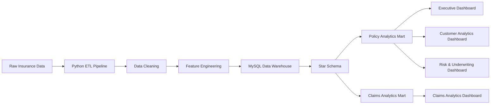

# 🏦 Enterprise Insurance Analytics Platform

> **Designed and implemented an end-to-end enterprise Business Intelligence platform that transforms raw insurance data into executive decision intelligence using Python, MySQL Data Warehouse, Star Schema modeling, Analytics Marts, and Tableau.**

### End-to-End Business Intelligence Solution for Portfolio Performance, Customer Intelligence, Claims Operations & Underwriting Risk Analytics

<p align="center">


</p>

---

## 📌 Project Overview

The **Enterprise Insurance Analytics Platform** is a consulting-style Business Intelligence solution designed to transform raw insurance operational data into executive-ready business insights.

The project simulates a real-world enterprise analytics ecosystem by integrating **Python-based ETL**, **feature engineering**, **MySQL dimensional data warehouse**, **analytics marts**, and **interactive Tableau dashboards** into a unified decision-support platform.

Rather than building standalone dashboards, the solution follows a modern Business Intelligence architecture where data is engineered, modeled, governed, and presented through purpose-built analytical layers that support strategic and operational decision-making.

The platform enables insurance executives, business analysts, underwriting managers, and claims teams to monitor portfolio performance, customer behavior, operational efficiency, financial exposure, and underwriting risk from a single analytics ecosystem.

---

# 🎯 Executive Summary

Insurance organizations generate millions of transactions across policies, customers, claims, payments, and underwriting processes. While operational systems efficiently capture these transactions, they are rarely optimized for enterprise reporting and strategic decision-making.

This project addresses that challenge by designing and implementing a complete **Enterprise Insurance Analytics Platform** using industry-standard Business Intelligence practices.

The solution begins with Python-driven data preparation and feature engineering, followed by the construction of a dimensional data warehouse in MySQL using Star Schema modeling principles. To preserve analytical accuracy and business context, separate analytics marts were developed for policy analytics and claims analytics, ensuring proper grain management and scalable reporting.

On top of this semantic layer, four executive Tableau dashboards were designed to support different business functions:

- Executive Portfolio Performance
- Customer & Policy Analytics
- Claims Analytics & Settlement Intelligence
- Risk & Underwriting Intelligence

Together, these dashboards provide a 360-degree analytical view of insurance operations, enabling business users to monitor key performance indicators, identify operational bottlenecks, evaluate portfolio risk, optimize underwriting decisions, and support data-driven business strategy.

The project demonstrates the complete lifecycle of an enterprise Business Intelligence solution—from data engineering and dimensional modeling to executive analytics and business storytelling.

---

## 🌟 Project Highlights

✔ End-to-End Enterprise Business Intelligence Platform

✔ Python Data Generation & Feature Engineering

✔ MySQL Dimensional Data Warehouse

✔ Star Schema Data Modeling

✔ Subject-Oriented Analytics Marts

✔ Executive KPI Framework

✔ Interactive Tableau Dashboards

✔ Insurance Portfolio Analytics

✔ Claims Operations Intelligence

✔ Underwriting Risk Analytics

✔ Business-Oriented SQL Development

✔ Executive Storytelling & Decision Support


---

# 💼 Business Problem

Modern insurance companies operate across multiple business functions including policy administration, customer management, premium collection, claims processing, payment management, and underwriting.

Although these operational systems capture large volumes of transactional data, the information is often distributed across different business processes, making it difficult for executives and business teams to obtain a unified, real-time view of organizational performance.

As a result, decision-makers frequently encounter challenges such as:

- Lack of a centralized view of insurance portfolio performance.
- Limited visibility into customer demographics and policy adoption trends.
- Inefficient monitoring of claims processing and settlement performance.
- Difficulty identifying high-risk customers and underwriting exposure.
- Delayed business decisions due to fragmented reporting.
- Inconsistent KPI definitions across departments.
- Absence of a scalable analytics architecture to support enterprise reporting.

Without a structured Business Intelligence solution, organizations struggle to transform operational data into actionable insights that support strategic planning, operational efficiency, risk management, and customer-centric decision-making.

---

# 🎯 Business Objectives

The primary objective of this project was to design and implement an enterprise-grade Business Intelligence platform capable of transforming raw insurance data into meaningful, decision-ready insights.

The solution was designed to achieve the following business objectives:

### Portfolio Performance

- Provide executives with a centralized view of portfolio growth and premium performance.
- Monitor policy lifecycle and renewal trends.
- Track key insurance performance indicators.

---

### Customer Intelligence

- Analyze customer demographics and segmentation.
- Understand policy preferences across different customer groups.
- Identify high-value customer segments.
- Support customer retention and cross-selling strategies.

---

### Claims Operations

- Monitor claim volume and financial exposure.
- Measure claim approval and settlement efficiency.
- Identify high-value and high-severity claims.
- Improve operational transparency across claims processing.

---

### Underwriting Intelligence

- Evaluate portfolio risk distribution.
- Analyze underwriting exposure by customer, geography, and policy type.
- Compare premium pricing against portfolio risk.
- Support data-driven underwriting decisions.

---

### Enterprise Analytics

- Build a reusable dimensional data warehouse.
- Design scalable analytics marts for different business domains.
- Enable governed KPI reporting.
- Deliver interactive executive dashboards for business stakeholders.

---

# 👥 Target Business Users

The platform has been designed to support multiple business functions across an insurance organization.

| Business Function | Primary Use Cases |
|------------------|-------------------|
| Executive Leadership | Enterprise KPI Monitoring & Strategic Decision-Making |
| Business Analysts | Trend Analysis, KPI Tracking & Business Insights |
| Claims Managers | Claims Performance, Settlement Monitoring & Operational Efficiency |
| Underwriting Teams | Risk Assessment, Pricing Analysis & Portfolio Monitoring |
| Sales & Customer Teams | Customer Segmentation, Policy Performance & Retention Analysis |

---

# 📊 Business Value Delivered

The platform delivers measurable business value by integrating data engineering, dimensional modeling, analytics, and visualization into a single enterprise reporting ecosystem.

Key outcomes include:

- Executive-level visibility into insurance portfolio performance.
- 360° customer analytics for strategic decision-making.
- Operational monitoring of claims processing and settlement efficiency.
- Risk-based underwriting insights for pricing optimization.
- Reusable analytics marts supporting scalable reporting.
- Standardized KPI definitions across business functions.
- Improved data accessibility through interactive dashboards.
- Faster, data-driven business decision-making.

---

# ✅ Solution Success Criteria

The Enterprise Insurance Analytics Platform was designed to achieve the following outcomes:

- Deliver a unified analytics ecosystem across portfolio, customer, claims, and underwriting functions.
- Enable executives to monitor business performance through standardized KPIs.
- Preserve analytical accuracy using dimensional modeling and subject-oriented analytics marts.
- Support scalable reporting through reusable data warehouse architecture.
- Transform operational insurance data into actionable business intelligence for strategic decision-making.


---

# 🏗️ Solution Architecture

The Enterprise Insurance Analytics Platform follows a layered Business Intelligence architecture designed to transform raw operational insurance data into executive-ready business intelligence.

Rather than connecting visualization tools directly to raw datasets, the platform implements a structured analytics pipeline consisting of data engineering, dimensional modeling, analytics marts, and executive dashboards.

This architecture improves scalability, analytical accuracy, maintainability, and reporting performance while preserving business context throughout the analytics lifecycle.


## 📐 End-to-End Analytics Architecture



## 🏛️ Enterprise Solution Layers

The platform has been designed using a multi-layer Business Intelligence architecture.

| Layer | Purpose |
|--------|----------|
| Data Generation | Simulate enterprise insurance operations |
| Data Engineering | Clean, validate and enrich business data |
| Data Warehouse | Store integrated dimensional data |
| Star Schema | Enable scalable analytical querying |
| Analytics Marts | Business-specific semantic models |
| Visualization | Executive decision-support dashboards |


## ⚙️ Data Engineering Pipeline

The platform begins with a Python-driven ETL pipeline responsible for preparing business-ready insurance data before loading it into the enterprise warehouse.

Key engineering activities include:

- Synthetic enterprise data generation
- Data validation
- Missing value handling
- Business rule implementation
- Feature engineering
- Customer segmentation
- Risk score calculation
- High-risk identification
- Claim categorization
- Payment status enrichment

The resulting datasets are optimized for dimensional modeling and analytical reporting.

## 🗄️ Enterprise Data Warehouse

The warehouse follows Kimball dimensional modeling principles using a Star Schema architecture.

### Dimension Tables

- Customer
- Policy
- Risk
- Location
- Claim Status
- Payment Status
- Date

### Fact Tables

- FactPolicies
- FactClaims
- FactPayments

The warehouse separates descriptive business attributes from transactional measures, enabling scalable analytical reporting while maintaining referential integrity.

## 📊 Analytics Marts

To preserve analytical accuracy and business grain, the platform implements separate subject-oriented analytics marts.

### Policy Analytics Mart

**Grain**

One Row = One Policy

Supports:

- Executive Dashboard
- Customer Analytics
- Portfolio Performance
- Underwriting Analytics

---

### Claims Analytics Mart

**Grain**

One Row = One Claim

Supports:

- Claims Analytics
- Settlement Intelligence
- Claims Operations
- Risk Monitoring

This approach prevents grain violations, avoids duplicate aggregations, and provides optimized semantic models for different business functions.


## 📈 Executive Dashboard Suite

The analytics platform consists of four executive dashboards designed for different business stakeholders.

| Dashboard | Business Function |
|------------|------------------|
| Executive Overview | Enterprise KPI Monitoring |
| Customer & Policy Analytics | Customer Intelligence |
| Claims Analytics & Settlement Intelligence | Claims Operations |
| Risk & Underwriting Intelligence | Risk Management |


## 🧠 Architecture Principles

The solution was designed following modern Business Intelligence engineering principles:

- Layered enterprise architecture
- Dimensional modeling
- Star Schema design
- Subject-oriented analytics marts
- Business-first KPI modeling
- Grain preservation
- Data quality validation
- Semantic data modeling
- Executive storytelling


---

# 🛠️ Technology Stack

The Enterprise Insurance Analytics Platform was built using a modern Business Intelligence technology stack that reflects the architecture commonly found in enterprise analytics solutions.

Each technology was selected based on its role within the analytics lifecycle, from data engineering to executive reporting.

---

## Technology Overview

| Layer | Technology | Purpose |
|--------|------------|---------|
| Programming Language | Python | Data generation, feature engineering & ETL |
| Database | MySQL 8.0 | Enterprise Data Warehouse |
| Query Language | SQL | Data transformation, KPI development & analytics |
| Data Modeling | Star Schema | Dimensional warehouse design |
| Analytics Layer | Analytics Marts | Business-oriented semantic models |
| Visualization | Tableau | Executive dashboards & decision support |
| Version Control | Git & GitHub | Source code management & collaboration |

---

# 🐍 Python

Python serves as the primary data engineering layer of the platform.

Key responsibilities include:

- Enterprise insurance data generation
- Data cleaning and preprocessing
- Missing value handling
- Feature engineering
- Business rule implementation
- Risk score calculation
- Customer segmentation
- Claim categorization
- Data validation

Python transforms raw operational data into analytics-ready datasets before loading them into the enterprise warehouse.

---

# 🗄️ MySQL Enterprise Data Warehouse

The platform uses MySQL as the centralized analytical database.

Responsibilities include:

- Enterprise data storage
- Star Schema implementation
- Dimension modeling
- Fact table management
- Referential integrity
- Analytics mart creation
- SQL-based business analytics

The warehouse acts as the single source of truth for all downstream reporting.

---

# 🧮 SQL

SQL is used throughout the project to build the analytical foundation.

Major implementations include:

- Data loading
- Dimensional modeling
- Business KPI calculations
- Operational reporting
- Executive analytics
- Data quality validation
- Advanced analytical queries
- Analytics mart development

The project contains multiple production-style SQL scripts organized by business function.

---

# ⭐ Star Schema

The warehouse follows Kimball dimensional modeling principles.

Core design components include:

### Dimension Tables

- Customer
- Policy
- Risk
- Location
- Date
- Claim Status
- Payment Status

### Fact Tables

- FactPolicies
- FactClaims
- FactPayments

This design improves scalability, query performance, and analytical consistency.

---

# 📊 Analytics Marts

Rather than connecting Tableau directly to warehouse tables, the platform introduces dedicated analytics marts.

### Policy Analytics Mart

Purpose:

- Executive Reporting
- Customer Analytics
- Portfolio Monitoring
- Underwriting Analytics

---

### Claims Analytics Mart

Purpose:

- Claims Operations
- Settlement Intelligence
- Claims Performance
- Financial Exposure Analysis

This layered architecture preserves business grain while simplifying dashboard development.

---

# 📈 Tableau

Tableau serves as the executive reporting layer of the platform.

The project contains four consulting-style dashboards:

- Executive Overview
- Customer & Policy Analytics
- Claims Analytics & Settlement Intelligence
- Risk & Underwriting Intelligence

Each dashboard supports a different business function while maintaining a unified executive reporting experience.

---

# 🔄 Development Methodology

The project follows an enterprise Business Intelligence development lifecycle.

```text
Business Problem

↓

Data Engineering

↓

Enterprise Data Warehouse

↓

Star Schema Modeling

↓

Analytics Marts

↓

Executive KPI Layer

↓

Interactive Dashboards

↓

Business Decision Support
```

This structured approach ensures analytical accuracy, scalability, maintainability, and business alignment throughout the solution.

---

# 🏛️ Enterprise Data Warehouse Design

The Enterprise Insurance Analytics Platform follows a dimensional modeling approach based on **Kimball's Star Schema methodology**.

Instead of querying raw transactional datasets directly, business data is transformed into a structured analytical model that separates descriptive business entities from measurable business events.

This architecture improves:

- Query performance
- Business readability
- Data consistency
- Scalability
- Dashboard performance
- Enterprise reporting

The warehouse serves as the centralized analytical foundation for all downstream reporting and executive dashboards.

---

# 📐 Data Warehouse Architecture

The warehouse consists of three logical layers.

```text
Raw Insurance Data

        │

        ▼

Enterprise Data Warehouse

        │

 ┌──────┼──────────┐

 ▼      ▼          ▼

Dimensions      Facts

        │

        ▼

Analytics Marts

        │

        ▼

Executive Dashboards
```

---

# ⭐ Star Schema Design

The warehouse implements a classic Star Schema architecture consisting of dimension tables and fact tables.

This approach minimizes redundancy while maximizing analytical flexibility.

---

## Dimension Tables

Dimension tables contain descriptive business attributes used for filtering, grouping, and business analysis.

| Dimension | Business Purpose |
|------------|------------------|
| DimCustomer | Customer demographics & segmentation |
| DimPolicy | Policy information & lifecycle |
| DimRisk | Underwriting risk assessment |
| DimLocation | Geographic analysis |
| DimDate | Time intelligence |
| DimClaimStatus | Claims lifecycle monitoring |
| DimPaymentStatus | Payment tracking |

Each dimension contains surrogate keys to maintain referential integrity and simplify analytical joins.

---

## Fact Tables

Fact tables store measurable business events.

| Fact Table | Business Event |
|------------|----------------|
| FactPolicies | Policy issuance & premium metrics |
| FactClaims | Claims transactions |
| FactPayments | Premium payment transactions |

Each fact table references multiple dimensions using surrogate keys, enabling multidimensional analysis across different business perspectives.

---

# 🔑 Why Surrogate Keys?

Instead of relying on operational business identifiers, the warehouse uses integer-based surrogate keys.

Example:

CustomerID

↓

CustomerKey

PolicyID

↓

PolicyKey

Benefits include:

- Improved query performance
- Reduced storage requirements
- Stable relationships
- Simplified joins
- Better scalability
- Enterprise-standard warehouse design

---

# 📊 Fact Table Grain

One of the most important architectural decisions in the platform was defining the correct grain for every fact table.

| Fact Table | Grain |
|------------|--------|
| FactPolicies | One Row = One Policy |
| FactClaims | One Row = One Claim |
| FactPayments | One Row = One Payment |

Maintaining consistent grain prevents duplicate aggregations, preserves analytical accuracy, and enables scalable reporting.

---

# 🧠 Analytics Modeling Principles

The warehouse was designed following industry best practices.

✔ Star Schema

✔ Dimensional Modeling

✔ Subject-Oriented Design

✔ Grain Preservation

✔ Surrogate Keys

✔ Referential Integrity

✔ Business-Oriented Dimensions

✔ Fact-Dimension Separation

✔ Reusable Semantic Layer

✔ Executive Reporting Optimization

---

# 📊 Analytics Marts

Rather than exposing warehouse tables directly to Tableau, the platform introduces dedicated analytics marts optimized for different business functions.

## Policy Analytics Mart

**Grain**

One Row = One Policy

Supports:

- Executive Overview
- Customer Analytics
- Portfolio Performance
- Underwriting Intelligence

---

## Claims Analytics Mart

**Grain**

One Row = One Claim

Supports:

- Claims Operations
- Settlement Intelligence
- Claims Performance
- Financial Exposure Analysis

This separation preserves business grain and eliminates double-counting while simplifying dashboard development.

---

# 🎯 Why Two Analytics Marts?

During solution design, two separate analytics marts were intentionally created instead of a single enterprise reporting table.

### Business Reason

Claims data exists at a different business grain than policy data.

Attempting to merge both into a single reporting table would create row multiplication and incorrect aggregations.

By designing dedicated analytics marts:

- Policy KPIs remain accurate
- Claims analytics remain operationally focused
- Dashboard performance improves
- Business logic remains easier to maintain
- Analytical accuracy is preserved

This architectural decision reflects enterprise Business Intelligence best practices for semantic modeling.

---

# 🏆 Data Warehouse Highlights

- Enterprise Star Schema implementation
- Three fact tables
- Seven dimension tables
- Two subject-oriented analytics marts
- Surrogate key architecture
- Referential integrity enforcement
- Business-oriented dimensional modeling
- Executive reporting optimization

# 📊 Executive Dashboard Suite

The Enterprise Insurance Analytics Platform provides four executive dashboards designed for different business functions across the insurance value chain.

Each dashboard serves a unique audience while sharing a common dimensional warehouse and governed KPI framework.

---

## Dashboard Ecosystem

| Dashboard | Business Function | Primary Users |
|------------|------------------|---------------|
| Executive Overview | Enterprise Performance | CXOs, Directors |
| Customer & Policy Analytics | Customer Intelligence | Business Teams |
| Claims Analytics | Claims Operations | Claims Managers |
| Risk & Underwriting Intelligence | Risk Management | Underwriting Teams |

---


# 📈 Dashboard 1 — Executive Overview


### Purpose

Provides a real-time executive view of portfolio performance through enterprise KPIs and high-level operational monitoring.

### Primary Users

- CEO
- COO
- Executive Leadership
- Business Heads

### Key KPIs

- Total Premium Revenue
- Total Policies
- Claim Ratio
- Active Policies
- Renewal Rate
- Payment Success Rate

### Business Decisions Supported

- Portfolio growth monitoring
- Premium performance
- Operational health
- Executive KPI tracking
- Strategic business planning

# 👥 Dashboard 2 — Customer & Policy Analytics


### Purpose

Provides a 360-degree view of customer demographics, policy distribution, and premium contribution to support customer-centric business decisions.

### Primary Users

- Business Analysts
- Marketing Teams
- Customer Strategy Teams
- Product Managers

### Key KPIs

- Total Customers
- Revenue per Customer
- Average Premium
- Average Age

### Business Decisions Supported

- Customer segmentation
- Policy adoption analysis
- Cross-selling opportunities
- Customer retention strategy
- Product performance analysis


# 🛡️ Dashboard 3 — Claims Analytics & Settlement Intelligence


### Purpose

Monitors claim performance, settlement efficiency, financial exposure, and operational effectiveness across the insurance claims lifecycle.

### Primary Users

- Claims Managers
- Claims Operations Teams
- Chief Risk Officer
- Business Analysts

### Key KPIs

- Total Claims
- Total Claim Amount
- Average Claim Amount
- Approval Ratio
- Settlement Days
- High Claim Percentage

### Business Decisions Supported

- Claims monitoring
- Settlement optimization
- Operational efficiency
- High-value claim tracking
- Financial exposure management


# ⚠️ Dashboard 4 — Risk & Underwriting Intelligence


### Purpose

Provides strategic underwriting insights by combining portfolio risk, premium pricing, customer demographics, and geographic exposure into a single executive decision-support dashboard.

### Primary Users

- Chief Underwriting Officer
- Underwriting Managers
- Risk Management Teams
- Executive Leadership

### Key KPIs

- Average Risk Score
- High Risk Customers
- High Risk %
- Premium per Risk Point
- Average Coverage
- Average Premium

### Business Decisions Supported

- Portfolio risk monitoring
- Underwriting strategy
- Premium pricing optimization
- Geographic risk assessment
- Customer risk evaluation
- Risk-based decision making


---

# 🧭 Executive Dashboard Navigation

```text
Executive Overview
          │
          ▼

Customer & Policy Analytics
          │
          ▼

Claims Analytics & Settlement Intelligence
          │
          ▼

Risk & Underwriting Intelligence
```

Each dashboard builds upon the previous one, providing a progressive analytical journey from enterprise portfolio monitoring to operational intelligence and strategic underwriting decisions.


# 📊 Dashboard Summary

| Dashboard | KPIs | Visuals | Business Questions |
|------------|------|----------|--------------------|
| Executive Overview | 10 | 8 | Portfolio Performance |
| Customer Analytics | 8 | 8 | Customer Intelligence |
| Claims Analytics | 6 | 7 | Claims Operations |
| Underwriting Analytics | 6 | 8 | Risk Management |

# 🎯 Business Capability Coverage

| Business Domain | Covered |
|-----------------|----------|
| Portfolio Analytics | ✅ |
| Customer Analytics | ✅ |
| Policy Analytics | ✅ |
| Claims Analytics | ✅ |
| Settlement Intelligence | ✅ |
| Payment Analytics | ✅ |
| Risk Analytics | ✅ |
| Underwriting Analytics | ✅ |
| Geographic Analytics | ✅ |
| Executive KPI Reporting | ✅ |


# Executive Portfolio KPIs

| KPI                       | Business Definition                         | Business Formula                             | Business Purpose          | Dashboard          |
| ------------------------- | ------------------------------------------- | -------------------------------------------- | ------------------------- | ------------------ |
| **Total Premium Revenue** | Total premium collected across all policies | `SUM(PremiumAmount)`                         | Measure portfolio revenue | Executive Overview |
| **Total Policies**        | Total number of issued policies             | `COUNT(PolicyID)`                            | Portfolio size monitoring | Executive Overview |
| **Active Policy %**       | Percentage of active policies               | `Active Policies ÷ Total Policies`           | Monitor policy lifecycle  | Executive Overview |
| **Claim Ratio**           | Claim amount compared with premium earned   | `Total Claim Amount ÷ Total Premium Revenue` | Profitability indicator   | Executive Overview |
| **Renewal Rate**          | Percentage of renewed policies              | `Renewed Policies ÷ Total Policies`          | Customer retention        | Executive Overview |
| **Payment Success Rate**  | Successful premium collections              | `Successful Payments ÷ Total Payments`       | Collection efficiency     | Executive Overview |


# Customer Intelligence KPIs 

| KPI                                                   | Business Definition                     | Business Formula             | Business Purpose        | Dashboard          |
| ----------------------------------------------------- | --------------------------------------- | ---------------------------- | ----------------------- | ------------------ |
| **Total Customers**                                   | Unique insured customers                | `COUNTD(CustomerID)`         | Customer base size      | Customer Analytics |
| **Average Premium**                                   | Average premium paid per policy         | `AVG(PremiumAmount)`         | Pricing analysis        | Customer Analytics |
| **Revenue per Customer**                              | Premium generated per customer          | `Total Premium ÷ Customers`  | Customer value analysis | Customer Analytics |
| **Policies per Customer** *(recommended enhancement)* | Average policies owned by each customer | `Total Policies ÷ Customers` | Cross-sell opportunity  | Customer Analytics |


# Claims Operations KPIs

| KPI                         | Business Definition             | Business Formula                 | Business Purpose             | Dashboard        |
| --------------------------- | ------------------------------- | -------------------------------- | ---------------------------- | ---------------- |
| **Total Claims**            | Total claims submitted          | `COUNT(ClaimID)`                 | Operational workload         | Claims Analytics |
| **Total Claim Amount**      | Total financial exposure        | `SUM(ClaimAmount)`               | Claims cost monitoring       | Claims Analytics |
| **Average Claim Amount**    | Average payout per claim        | `AVG(ClaimAmount)`               | Claim severity analysis      | Claims Analytics |
| **Claim Approval Ratio**    | Percentage of approved claims   | `Approved Claims ÷ Total Claims` | Claims processing efficiency | Claims Analytics |
| **Average Settlement Days** | Average time to settle claims   | `AVG(SettlementDays)`            | Operational SLA monitoring   | Claims Analytics |
| **High Claim %**            | Percentage of high-value claims | `High Claims ÷ Total Claims`     | Risk exposure monitoring     | Claims Analytics |


# Underwriting Intelligence KPIs

| KPI                        | Business Definition               | Business Formula                       | Business Purpose        | Dashboard    |
| -------------------------- | --------------------------------- | -------------------------------------- | ----------------------- | ------------ |
| **Average Risk Score**     | Average portfolio risk            | `AVG(RiskScore)`                       | Portfolio quality       | Underwriting |
| **High Risk Customers**    | Number of high-risk policyholders | `SUM(HighRiskFlag)`                    | Underwriting exposure   | Underwriting |
| **High Risk %**            | Percentage of high-risk customers | `High Risk Customers ÷ Total Policies` | Portfolio concentration | Underwriting |
| **Average Coverage**       | Average insured amount            | `AVG(CoverageAmount)`                  | Exposure management     | Underwriting |
| **Premium per Risk Point** | Premium earned per unit of risk   | `Total Premium ÷ Total Risk Score`     | Pricing adequacy        | Underwriting |
| **Average Premium**        | Average premium charged           | `AVG(PremiumAmount)`                   | Premium strategy        | Underwriting |


## KPI Governance

To ensure consistency across dashboards, every KPI follows a standardized governance framework.

### KPI Design Principles

- Single business definition for every KPI.
- Consistent calculations across all dashboards.
- Reusable SQL logic within analytics marts.
- Business-friendly naming conventions.
- Executive-focused metric presentation.
- Validation against warehouse data before visualization.

## KPI Lifecycle

```text
Business Requirement

↓

Business Definition

↓

SQL Calculation

↓

Analytics Mart

↓

Tableau KPI Card

↓

Executive Decision
```

## Business Value

The KPI framework transforms operational insurance data into standardized business metrics that support strategic and operational decision-making.

Benefits include:

- Enterprise-wide KPI consistency.
- Improved executive visibility.
- Faster business reporting.
- Standardized performance measurement.
- Better cross-functional communication.
- Scalable analytical reporting.

# KPI Ownership Matrix

| KPI Category      | Business Owner               |
| ----------------- | ---------------------------- |
| Portfolio KPIs    | Executive Leadership         |
| Customer KPIs     | Marketing & Customer Success |
| Claims KPIs       | Claims Operations            |
| Underwriting KPIs | Underwriting Team            |
| Payment KPIs      | Finance & Collections        |


---

# 💡 Business Questions Solved

The Enterprise Insurance Analytics Platform was designed around real-world business questions faced by insurance executives, business analysts, claims managers, and underwriting teams.

Rather than creating dashboards first, the solution begins by identifying critical business questions and then designing data models, KPIs, and visualizations that support evidence-based decision-making.

This business-first approach ensures that every metric and dashboard directly contributes to solving an operational or strategic challenge.

## 📈 Executive Portfolio Performance

| Business Question | KPI | Dashboard | Business Decision |
|-------------------|-----|-----------|-------------------|
| How is the insurance portfolio performing? | Total Premium Revenue | Executive Overview | Portfolio growth strategy |
| Are policy sales increasing? | Total Policies | Executive Overview | Business expansion planning |
| What percentage of policies remain active? | Active Policy % | Executive Overview | Customer retention monitoring |
| Is the company paying more claims than expected? | Claim Ratio | Executive Overview | Profitability assessment |
| Are customers renewing their policies? | Renewal Rate | Executive Overview | Retention strategy |
| Are premium collections successful? | Payment Success Rate | Executive Overview | Collection performance |


## 👥 Customer & Policy Analytics

| Business Question | KPI | Dashboard | Business Decision |
|-------------------|-----|-----------|-------------------|
| Who are our customers? | Customer Demographics | Customer Analytics | Market understanding |
| Which age groups generate the highest revenue? | Revenue by Age Bucket | Customer Analytics | Marketing strategy |
| Which products are most popular? | Policy Distribution | Customer Analytics | Product planning |
| Which customer segments create the most value? | Revenue per Customer | Customer Analytics | Customer prioritization |
| Are there cross-selling opportunities? | Policies per Customer | Customer Analytics | Cross-sell campaigns |
| Which demographics require targeted marketing? | Premium by Customer Segment | Customer Analytics | Customer acquisition |


## 🛡️ Claims Analytics & Settlement Intelligence

| Business Question | KPI | Dashboard | Business Decision |
|-------------------|-----|-----------|-------------------|
| How many claims are being processed? | Total Claims | Claims Analytics | Capacity planning |
| What is our financial exposure? | Total Claim Amount | Claims Analytics | Reserve management |
| How severe are our claims? | Average Claim Amount | Claims Analytics | Risk monitoring |
| Are claims being approved efficiently? | Approval Ratio | Claims Analytics | Claims process improvement |
| How long do settlements take? | Average Settlement Days | Claims Analytics | SLA monitoring |
| Which products generate expensive claims? | Claim Amount by Policy Type | Claims Analytics | Product pricing review |
| Which regions generate the highest claims? | State-wise Claims | Claims Analytics | Geographic risk planning |


## ⚠️ Risk & Underwriting Intelligence

| Business Question | KPI | Dashboard | Business Decision |
|-------------------|-----|-----------|-------------------|
| How risky is our portfolio? | Average Risk Score | Underwriting | Portfolio monitoring |
| How many high-risk customers do we insure? | High Risk Customers | Underwriting | Underwriting exposure |
| Are high-risk customers paying enough premium? | Premium per Risk Point | Underwriting | Pricing optimization |
| Which products carry the greatest risk? | Risk Score by Policy Type | Underwriting | Product pricing |
| Which age groups require stricter underwriting? | Risk by Age Bucket | Underwriting | Risk strategy |
| Which regions create underwriting exposure? | Geographic Risk | Underwriting | Regional underwriting |
| Are we underpricing high-risk products? | Underwriting Matrix | Underwriting | Pricing review |


## 🏢 Business Capability Coverage

| Business Capability | Supported |
|---------------------|-----------|
| Executive Reporting | ✅ |
| Portfolio Monitoring | ✅ |
| Customer Analytics | ✅ |
| Product Analytics | ✅ |
| Claims Operations | ✅ |
| Settlement Intelligence | ✅ |
| Payment Monitoring | ✅ |
| Risk Analytics | ✅ |
| Underwriting Analytics | ✅ |
| Geographic Analytics | ✅ |
| KPI Governance | ✅ |
| Decision Support | ✅ |


## 🧠 Business Decision Framework

```text
Business Question

↓

Business KPI

↓

SQL Logic

↓

Analytics Mart

↓

Tableau Dashboard

↓

Executive Decision

↓

Business Action
```


## 🎯 Business-First Design Philosophy

The platform was designed using a Business Question Driven Development approach.

Every dashboard, KPI, SQL transformation, and analytics mart was created to answer a specific business question rather than simply visualize available data.

This approach ensures that analytics remain aligned with business objectives, executive decision-making, and measurable organizational outcomes.


## 🚀 Executive Decisions Enabled

The platform enables insurance leaders to make informed decisions across multiple business domains.

Examples include:

- Monitor enterprise portfolio performance.
- Improve customer retention strategies.
- Optimize policy pricing.
- Reduce claims settlement delays.
- Monitor financial exposure.
- Identify high-risk customers.
- Improve underwriting decisions.
- Optimize regional business strategies.
- Standardize enterprise KPIs.
- Support data-driven executive reporting.


---

# ⚙️ Technical Highlights

The Enterprise Insurance Analytics Platform demonstrates the complete lifecycle of a modern Business Intelligence solution, combining data engineering, dimensional modeling, SQL analytics, semantic modeling, and executive visualization.

The project emphasizes business-driven architecture rather than tool-centric implementation, ensuring scalability, maintainability, and analytical accuracy.

---

# 🏗️ Enterprise Architecture Highlights

The platform was designed following industry-standard Business Intelligence architecture principles.

### ✔ Layered Enterprise Architecture

The solution separates responsibilities into distinct analytical layers:

- Data Engineering
- Enterprise Data Warehouse
- Star Schema
- Analytics Marts
- Executive Dashboards

This layered design improves maintainability and supports future scalability.

---

### ✔ Dimensional Data Modeling

The warehouse follows Kimball dimensional modeling principles.

Key implementations include:

- Star Schema
- Dimension Tables
- Fact Tables
- Surrogate Keys
- Referential Integrity
- Business-Oriented Modeling

This approach enables fast analytical queries while preserving business context.

---

### ✔ Subject-Oriented Analytics Marts

Rather than exposing warehouse tables directly to Tableau, dedicated semantic models were created.

Implemented analytics marts:

- Policy Analytics Mart
- Claims Analytics Mart

Benefits include:

- Grain preservation
- Simplified reporting
- Faster dashboard development
- Improved analytical accuracy
- Better business maintainability

---

# 🔑 Data Engineering Highlights

Python was used to transform raw insurance data into analytics-ready datasets.

Implemented capabilities include:

- Synthetic enterprise data generation
- Data cleaning
- Feature engineering
- Missing value handling
- Business rule implementation
- Customer segmentation
- Risk score generation
- Claim categorization
- Data validation
- Data quality enhancement

These transformations significantly improve downstream reporting quality.

---

# 🗄️ SQL Engineering Highlights

SQL serves as the analytical backbone of the platform.

Implemented SQL capabilities include:

### Database Design

- Database creation
- Warehouse implementation
- Table design
- Constraint management

### Data Modeling

- Dimension loading
- Fact loading
- Surrogate key mapping
- Referential integrity

### Business Analytics

- KPI calculations
- Aggregations
- Window Functions
- CASE expressions
- Business rule implementation
- Executive reporting queries

### Data Quality

- Duplicate detection
- Missing value validation
- Referential integrity checks
- Business validation queries

---

# 📊 Tableau Engineering Highlights

The visualization layer consists of four consulting-style executive dashboards.

Implemented capabilities include:

- Executive KPI cards
- Interactive dashboard filters
- Dynamic Top-N analysis
- Calculated fields
- Parameter-driven analysis
- Cross-dashboard consistency
- Executive storytelling
- Business-oriented visual design

Each dashboard was developed around specific business questions rather than simply presenting data.

---

# 🧠 Business Intelligence Engineering Decisions

Several architectural decisions were intentionally made to improve enterprise reporting quality.

### Decision 1 — Star Schema

Chosen to improve analytical query performance and simplify business reporting.

---

### Decision 2 — Surrogate Keys

Implemented to improve join performance and preserve stable warehouse relationships.

---

### Decision 3 — Analytics Marts

Separate policy and claims marts were created to maintain business grain and eliminate duplicate aggregations.

---

### Decision 4 — KPI Governance

Business metrics were standardized across dashboards to ensure consistent executive reporting.

---

### Decision 5 — Grain Preservation

Each fact table and analytics mart was designed with an explicitly defined grain to prevent row multiplication and maintain analytical accuracy.

---

# 🏆 Technical Best Practices Implemented

The project incorporates multiple enterprise Business Intelligence best practices.

✔ Layered Architecture

✔ Kimball Star Schema

✔ Subject-Oriented Analytics Marts

✔ Grain Preservation

✔ Surrogate Keys

✔ Data Quality Validation

✔ Business Rule Implementation

✔ KPI Governance

✔ Semantic Modeling

✔ Executive Storytelling

✔ Business-First Dashboard Design

✔ Modular SQL Scripts

✔ Reusable Analytics Components

---

# 📈 Project Statistics

| Category | Implementation |
|-----------|----------------|
| Programming Language | Python |
| Database | MySQL 8.0 |
| SQL Scripts | 11+ |
| Fact Tables | 3 |
| Dimension Tables | 7 |
| Analytics Marts | 2 |
| Executive Dashboards | 4 |
| Business KPIs | 25+ |
| Business Questions Answered | 40+ |
| Visualizations | 30+ |

---

# 💡 Key Learnings

The project provided hands-on experience across the complete Business Intelligence lifecycle, including:

- Enterprise analytics architecture
- Data warehouse design
- Dimensional modeling
- SQL engineering
- Analytics mart development
- Executive dashboard design
- Business KPI development
- Insurance domain analytics
- Business storytelling
- Decision-support analytics

The experience reinforced the importance of designing analytics solutions that are driven by business questions rather than technology alone.


---

# 🚀 Future Enhancements

The current platform establishes a scalable Business Intelligence foundation for insurance analytics. Future versions could further enhance analytical capabilities through advanced technologies and predictive intelligence.

## Planned Enhancements

### 🤖 Machine Learning

- Claim fraud detection models
- Claim amount prediction
- Customer churn prediction
- Premium pricing optimization
- Risk score prediction
- Customer lifetime value estimation

---

### 📈 Advanced Analytics

- Real-time KPI monitoring
- Predictive portfolio analytics
- Executive forecasting dashboards
- Scenario & What-if analysis
- Customer profitability modeling
- Cohort analysis

---

### ☁️ Cloud Modernization

- Snowflake Data Warehouse
- Microsoft Azure
- AWS Analytics Stack
- Google BigQuery
- Databricks
- Apache Airflow

---

### 📊 Business Intelligence

- Power BI version
- Mobile executive dashboards
- Real-time operational reporting
- Executive alert framework
- Self-service analytics
- Row-Level Security (RLS)

---

### ⚙️ Data Engineering

- Automated ETL scheduling
- Incremental data loading
- CI/CD deployment
- Data quality monitoring
- Metadata management
- Data lineage documentation

---

# 📚 Key Project Learnings

Developing this platform provided practical experience across the complete Business Intelligence lifecycle.

## Business Analysis

- Translating business problems into analytical solutions.
- Defining executive KPIs.
- Mapping business questions to dashboards.
- Designing decision-support analytics.

---

## Data Engineering

- Building ETL pipelines.
- Data validation.
- Feature engineering.
- Business rule implementation.

---

## Data Warehousing

- Star Schema implementation.
- Fact and Dimension modeling.
- Surrogate Keys.
- Grain preservation.
- Analytics mart design.

---

## SQL Engineering

- Complex joins.
- Aggregations.
- Window Functions.
- KPI calculations.
- Data quality validation.
- Business reporting.

---

## Tableau

- Executive dashboard design.
- Interactive analytics.
- Dashboard storytelling.
- KPI visualization.
- Business-first reporting.

---

## Professional Skills

- Solution Architecture
- Business Storytelling
- Executive Communication
- Analytical Thinking
- Problem Solving
- Stakeholder Perspective

---

# 💼 Business Impact

The Enterprise Insurance Analytics Platform demonstrates how a structured Business Intelligence architecture can transform operational insurance data into strategic business intelligence.

The solution enables:

- Executive portfolio monitoring.
- Customer behavior analysis.
- Claims operational intelligence.
- Underwriting risk assessment.
- KPI standardization.
- Data-driven decision-making.

By integrating data engineering, dimensional modeling, analytics marts, SQL engineering, and executive dashboards into a unified solution, the platform reflects the architecture commonly adopted by enterprise Business Intelligence teams.

---

# 🎯 Project Outcomes

✔ End-to-End Enterprise BI Platform

✔ Enterprise Data Warehouse

✔ Kimball Star Schema

✔ Subject-Oriented Analytics Marts

✔ Executive KPI Framework

✔ Four Interactive Executive Dashboards

✔ Business-Oriented SQL Development

✔ Insurance Domain Analytics

✔ Decision-Support Reporting

✔ Executive Storytelling

---

# 🙋 About the Author

## Chetan Sakate

Business Analyst | Business Intelligence | Data Analytics | SQL | Tableau | Python | Data Warehousing

I enjoy designing business-focused analytical solutions that bridge the gap between raw data and executive decision-making.

My areas of interest include:

- Business Analysis
- Business Intelligence
- Product Analytics
- Data Warehousing
- Financial Services
- Insurance Analytics
- Banking & FinTech
- Executive Reporting
- Data Strategy

This project reflects my interest in building scalable analytical solutions that combine engineering discipline with business value.

---

# 📬 Let's Connect

If you found this project interesting or would like to discuss Business Intelligence, Data Analytics, or Insurance Analytics, feel free to connect.

- 💼 LinkedIn https://www.linkedin.com/in/chetan-sakate/
- 📧 Email : sakatechetan@gmail.com
- 🌐 Portfolio Website (Coming Soon)

---

# 🙏 Acknowledgements

This project was developed as a comprehensive Business Intelligence case study to simulate enterprise insurance analytics.

It incorporates concepts from:

- Business Analysis
- Data Engineering
- Data Warehousing
- SQL Analytics
- Tableau Visualization
- Executive Reporting
- Insurance Domain Analytics

The objective was not only to build dashboards, but to design a complete analytical ecosystem that supports business decision-making.

---

# ⭐ Support the Project

If you found this repository helpful:

⭐ Star the repository

🍴 Fork the project

💬 Share your feedback

🤝 Connect for collaboration

Your support and feedback are always appreciated.

---

# 🏁 Final Thought

> **"Data becomes valuable only when it enables better decisions."**

This project was built with that philosophy at its core—transforming raw insurance data into trusted, decision-ready intelligence through engineering, analytics, and business storytelling.